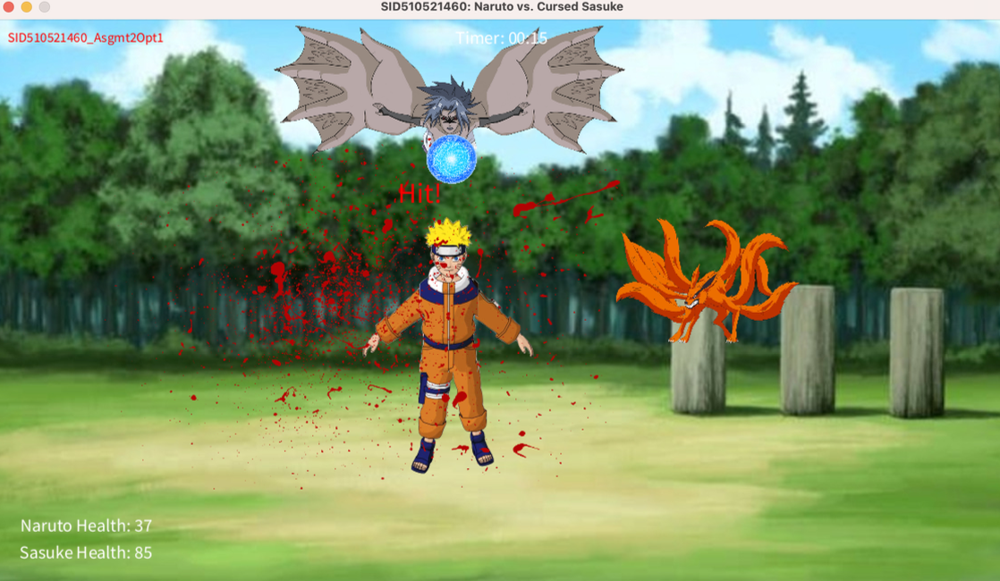
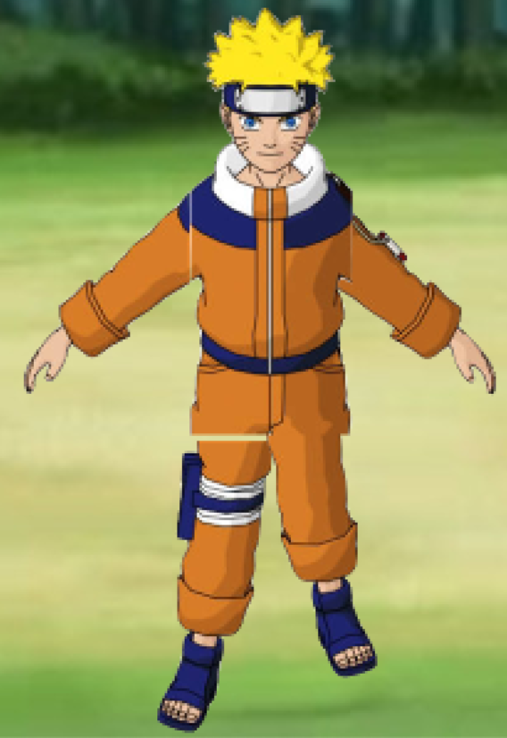
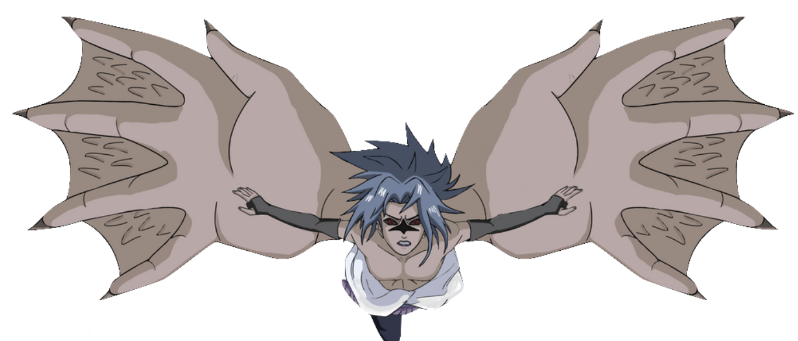
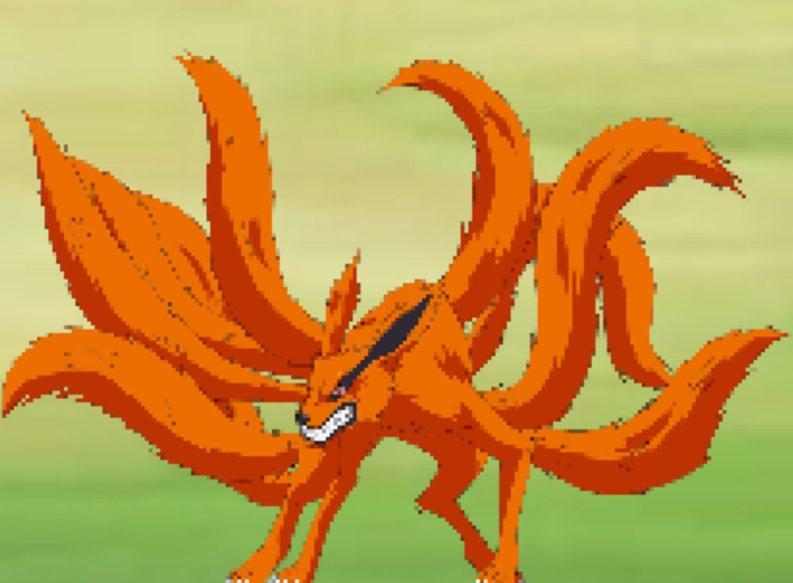
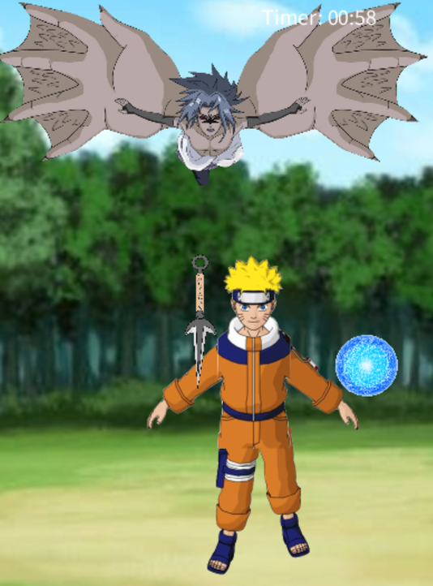
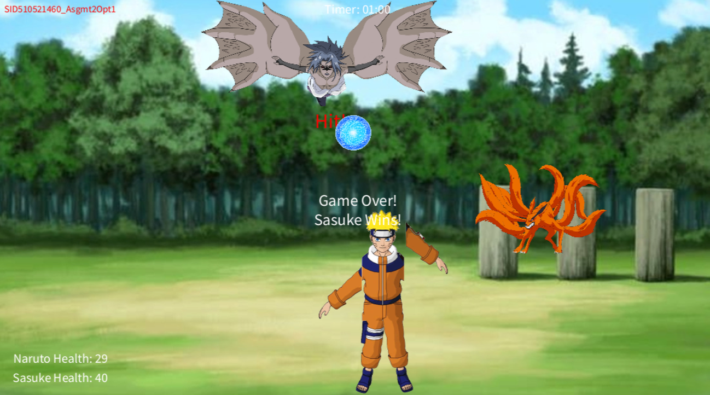
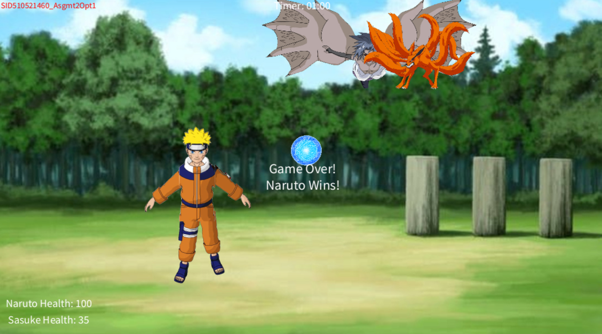
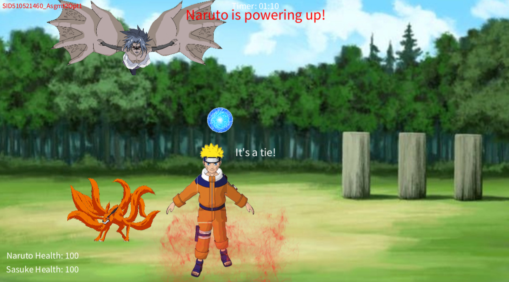

# naruto-motion-game
A motion-tracked interactive game using Java, where Naruto mimics movements from a video input, battles Cursed Sasuke, and interacts with Kurama for power-ups

This project is an interactive game built using Java and Processing, integrating digital video processing, compositing, and 2D animation techniques. The given input video ("Opt1-MarionetteMovements.mov") shows a monkey with 5 red markers on its body, legs, and hands. These markers control a digital marionette, Naruto, in this game. 

## Instructions 

1. Use Processing Version: 4.3
2. Run the extract.py Python script to extract frames from the monkey movie video before step 3. 
3. Inside the folder "naruto_motion_game", open the file "naruto_motion_game.pde" in Processing.
4. Click the 'run' button on the Processing editor to run the program.
5. Game Instructions are as follows:
- Press the 'left' or 'right' arrow keys to control Sasuke (the flying character). However, Sasuke cannot go out of bounds of the training ground (the screen). 
- Press the 'spacebar' key to attack Naruto -- this will shoot down kunais, and will decrease Naruto's health if Naruto gets hit by the kunai. Blood splatters will be shown if Naruto gets hit by the kunai knives. 
- Naruto will keep throwing Rasengans at Sasuke after each Rasengan is thrown.
- If Naruto's Rasengans hits Sasuke, Sasuke's health will decrease by 5 points each hit. Audio will also be played when Sasuke gets hit each time. At every multiple of 4 times Sasuke gets hit, it will play a different audio screaming "Narutooo", and the other times will play "Ough".
- Naruto is able to heal himself if Kurama (the nine-tailed fox) decides to go near Naruto and help him. Kurama moves randomly around the training ground (the screen). If Kurama happens to be near Naruto, Naruto gains Kurama's chakra and his health increases for the number of seconds that Kurama is near him. 
- Whoever has the higher health by the time limit of 1 min, wins the game. Specific audios will be played for specific winners, as well as for a tied game. 
- Throughout, a Naruto-theme song will be played! ENJOY 

Note: the setup in the program requires a few seconds to load. Please wait for about 7-8s for it to load. A video demo is provided (named "Video-Demo.mp4") to show a case of Sasuke winning, with sound effects.

## Story Development and script

The game is set in the Hidden Leaf Village, a battleground ravaged by battles.

*Main Character:*

Naruto: A digital marionette mimics the movements of the video input. He can throw energy balls (Rasengans) at his opponent.

*Side Characters:*

1. Sasuke: Moves left and right, controlled by the player. He can throw Kunai knives at Naruto.

2. Kurama: A nine-tailed fox that roams around the screen randomly. If he gets close to Naruto, Naruto earns some chakra and regains his health for the amount of seconds Kurama is near him.

*Game Events:*

Naruto launches Rasengan -> If it hits Sasuke, Sasuke loses health.

Sasuke throws Kunai -> If it hits Naruto, Naruto loses health.

Kurama moves randomly -> If near Naruto, Naruto's health regenerates.

*So, who wins?*

The game lasts for 1 minute.

If either character’s health reaches 0, the game ends.

If the timer runs out, the character with higher health wins.

*Winning Effects:*

If Sasuke wins, Naruto shouts "Sasukeee!".

If Naruto wins, he shouts his iconic "Dattebayo!".

If it’s a tie, both characters shout each other’s names.

## Motion Capture Implementation Steps

This game is written in Java using Processing, using video tracking to animate Naruto based on the input video.

1. Before the main implementation, the program loads images and sounds associated with the characters, as well as the given input video which is used to track movement.

2. I converted the input video to sequence of individual image frames, stored as ’.tif’ files.

3. I converted the frames to binary images. Each frame is processed to detect the red markers. This is to ignore unnecessary colors and focus only on movement based on red pixels in a binary image. 

4. This step invovles detecting motion with grid-based processing. Once the binary frame is ready, the program splits the entire frame into smaller grid blocks of size 7×7 pixels (determined by the variable `p` = 7). Each grid block will store its pixel values in an array `grid`. This is to analyse the movements in small sections instead of checking every single pixel. Also to consider reducing noise. 

5. Each block is scored based on red pixel intensity (summarise movement per block instead of per pixel). This means the block with higher scores contains more pixels of the target color (red).

6. This step involves sorting and select the red markers, where the top 5 highest-scoring grid blocks will determine Naruto’s movement. This is done using an array `five_red_points` which stores the coordinates of the top 5 blocks containing the most red pixels. 

7. Mapping motion to Naruto. These coordinates control Naruto’s limbs and position.

Note: Due to the loading of the sound files and many images, the game takes about 7-8 seconds to load before the game starts.

## Background and Marionette

1. Background replacement: I replaced the main background to be the training ground in the Hidden Leaf Village. Another dynamic background feature implemented is when Naruto gets hit by Sasuke’s Kunai knives, some ’blood’ platter appears on the screen for a few seconds. 

  

2. Marionette development: Naruto is the main character that will be replacing the moving monkey from the given video. It is controlled by the coordinates of the 5 red markers of the monkey in the input video (body, hands and legs).

## Intelligent Objects

### Characters 

1. **Naruto**: The character is composed of separate images for the body, right hand, left hand, right leg, and left leg. The character’s position and "powered up" state are tracked, with the latter will increase Naruto’s health for a duration. \
– Behavior/Movements: Its movements is controlled by the monkey in the input video. \
– Interaction: Naruto can shoot Rasengans (blue ball) upwards. If Naruto gets hit by Sasuke’s Kunai knives, there will be blood platters displayed for a few seconds on the screen. Naruto can also be healed by Kurama where there will be a power up effect (fire) when he is being healed and his health will increase. There will also be a description label "Narutoispoweringup!" in red at the top-middle of the screen.

2. **Sasuke**: Sasuke is the side character in the game with its image, position, and health status. Sasuke can shoot Kunai knives and has a health level counter that decreases upon being hit by Naruto’s Rasengans. \
– Behavior/Movements: Sasuke can be controlled by the player using the ’left’ and ’right’ keys. He can only move left and right and cannot exit the screen. \
– Interaction: He can launch attacks by throwing kunai knives at Naruto by pressing the space bar. His health can also decrease upon getting hit by Naruto’s Rasengans. There will be audio of him screaming Naruto (for every multiple of 4 times), and the other times, it will play a "Ough" sound effect of getting hit. When he also gets hit, there will be a "Hit!" in red displayed on where he got hit.

3. **Kurama**: Kurama is another side character, also known as the Nine-Tails, moves around to a random target position on the screen, assisting in powering up Naruto when close enough. \
– Behavior/Movements: Kurama moves around the screen randomly. \
– Interaction: If Kurama happens to be near Naruto, Naruto will be able to gain some
chakra, and Naruto’s health level will increase by the duration they are close enough.

  

**Figure 1:** Naruto (a)

  

**Figure 2:** Sasuke (b)

  

**Figure 3:** Kurama (c)

### Other objects

- Fire: An power up effect that visually show when Naruto is powered up.
- Kunai: These are additional projectiles that have their image, speed, and positions in an ArrayList to manage multiple kunais on-screen.
- Rasengan: This is a projectile that Naruto can shoot. Its position, speed, and hit state are tracked.

## Events

1. Key Presses: The game responds to spacebar presses to shoot kunai and arrow keys to move Sasuke left or right.
2. Rasengan Shooting: Naruto can shoot Rasengans. But he only can hit one Rasengan at a time.
3. Kunai Shooting: Triggered by the player’s input (spacebar), allowing Sasuke to shoot kunai.
4. Kurama Movement: Kurama moves towards a randomly chosen target position, and when close to Naruto, it triggers a power-up event.
5. Game End: The game ends if first, either of the characters has a health level of 0 or below, or second, the game reaches the time limit of 60 seconds. Whoever who has the higher health level remaining when the game is over, wins the game.

  

**Figure 4:** Kunai about to hit Naruto

  

**Figure 5:** Naruto getting his power up from Kurama

  

**Figure 6:** Sasuke won the game

  

**Figure 7:** Naruto won the game

  

**Figure 8:** Both won the game

